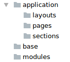

# Структура

Обычно файловая структура UpCss выглядит следующим образом:

Далее рассмотрим каждый каталог индивидуально.

### Base
Общие и базовые CSS-стили приложения. Например: компоненты framework`а,
reset-стили (или normalize-стили), конфигурации и другое. 

[Подробнее про Base](./upCss-base.md)

### Modules
В данном разделе могут находиться персональные заготовки, которые могут быть 
переиспользованы в различных проектах.

[Подробнее про Modules](./upCss-modules.md)

### Application
Каталог со всеми стилями Вашего приложения.

* **sections**  
Основные составляющие приложения. Ими может быть header, footer, sidebar,
navigation и другие секции, которые могут использоваться на разных страницах 
приложения. 

* **layouts**  
Стили, которые необходимы для формирования общего каркаса нескольких страниц
приложения.

* **pages**  
Стили, непосредственно, применяемые к конкретным страницам приложения, которые
не могут быть переиспользованы.

[Подробнее про Application](./upCss-application.md)

## Пример UpCss структуры простого приложения

* **build.scss**
* **base**
    * _reset.scss
    * _mixins.scss
    * _config.scss
    * _fonts.scss
    * _grid.scss
* **modules**
    * _alerts.scss
    * _buttons.scss
    * _forms.scss
    * _pagination.scss
    * _table.scss
* **application**
    * sections
        * _footer.scss
        * _header.scss
        * _headline.scss
    * layouts
        * base.scss
        * auth.scss
        * modal.scss
    * pages
        * home.scss
        * contact.scss
        * faq.scss
        * error.scss

--------

[Перейти к документации](https://github.com/nepster-web/UpCss#%D0%94%D0%BE%D0%BA%D1%83%D0%BC%D0%B5%D0%BD%D1%82%D0%B0%D1%86%D0%B8%D1%8F)