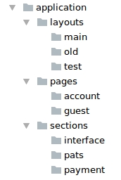

# Общие правила

Список общих правил, которые необходимо соблюдать для эффективного использования методологии UpCss.
Соблюдая данные правила, формируется четкая и понятная стандартизация, которая помогает
быстро и легко ориентироваться как в своем коде, так и в коде сторонних разработчиков.


# Base

* Запрещено использование **important**.

* Использование только классов общего назначения и компонентов framework`а, например:
    * reset или normalize стили
    * grid
    * Стили по умолчанию для: `body`, `a`, `img`, `b`, `string`, `i`, `em` и др.
    * Общие классы: `.text-left`, `.text-right`,  `.no-padding`, `.no-margin` и др.

* Общие заготовки в виде миксинов и др.


# Modules


# Application

* Основной каталог приложения, стили которого уникальны в рамках текущего проекта.
Если необходимо переиспользование классов из данного каталога, необходимо перенести их
в **base** или  **modules**.

* Каталог **layouts** и **pages** - необязательный. Небольшие приложения могут обходиться
общими стилями или компонентами framework`а.

* Каталог **application** как и любой другой подкаталог может использовать любую
логическую вложенность других подкаталогов, при условии, если это не нарушает базовую
структуру, например:




## Sections 

* Секции являются основной частью приложения. В связи с этим добавление префикса 
вроде `.s-` к каждой секции было бы излишне многословным. Поэтому секции
не используют префиксов, а имеют лишь свое собственное имя.

* Имя класса должно быть простым, понятным и полностью описывать секцию:
.header, .footer, .sidebar, .payment-form, .system-list и др.

* Не рекомендуется использовать длинные имена классов и вложенность для
генерации имен классов, состоящих из более трех знаков "-".

* Секция может предоставлять только абстрактные состояния, если секция содержит
слишком много состояний, стоит взглянуть на **pages** и **layouts**.

* Не рекомендуется использовать **important**.


## Layouts 

* Общий каркас для стилизации нескольких страниц приложения указывается 
путем добавления класса тегу body в html разметке:
    ```html
    <body class="l-base"> ... </body>
    ```

* Имя класса должно быть простым, понятным и начинаться с префикса `l-`, 
например: .l-base, .l-auth, .l-account и др.

* Один layout-класс может быть использован для нескольких страниц.

* Не рекомендуется использовать каркас для одной страницы. Если необходимо
стилизировать конкретную страницу, стоит взглянуть на **pages**.

* Каркас можно использовать совместно со страницей, указав тегу body два класса:
    ```html
    <body class="l-base p-contact"> ... </body>
    ```

## Pages

* Для стилизации конкретной страницы приложения необходимо указать класс
 тегу body в html разметке:
    ```html
    <body class="p-home"> ... </body>
    ```

* Имя класса должно быть простым, понятным и начинаться с префикса `p-`,
например: p-home, p-static, p-contact и др.

* Один page-класс может быть использован только для одной страницы.