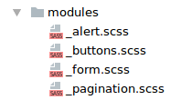

# Модули

Каждый проект индивидуален (при условии, что мы не рассматриваем шаблонные решения),
поэтому скорее всего Вам не удасться переиспользовать каркас, разметку 
и некоторые секции, как например header или footer, исходя из особенностей 
различных дизайнерских подходов. 

Однако существуют базовые компоненты, которые присутствуют практически 
в любом проекте и отличаются незначительно, например:

* Кнопки
* Таблицы
* Формы 
* Пагинация
* Уведомления
* и другие

>Совет: Старайтесь переиспользовать только абстрактные части проекта.

Такие абстрактные компоненты вполне можно подготовить заранее и переиспользовать
в других проектах, сконфигурировав под нужный стиль.

## Правила именования
Необходимо подобрать короткое лаконичное название для класса, которое
предоставит информацию о текущем модуле (компоненте). Некоторые модули 
могут включать состояния, меняющее стили отображения, например 
цвет или размер, в таком случае все подклассы пишутся через дефис:

```html
<div class="btn btn-base">Отправить</div>
<div class="btn btn-success">Сохранить</div>
<div class="btn btn-danger">Отменить</div>
```

```html
<div class="alert alert-info">Информационное уведомление</div>
<div class="alert alert-warning">Предупреждение</div>
```

>Совет: Старайтесь не перенасыщать модули излишними состояниями.

[Общие правила применяемые к модулям](./total-rules.md#modules)


### Пример
Хороший пример переиспользуемых модулей демонстрирует такой инструмент, 
как **[bootstrap](http://getbootstrap.com)**. Не обязательно 
применять весь bootstrap framework, отдельные его компоненты 
(alert, button, form, modal и другие) отлично используются
во множестве самых разных проектах.

Структура каталога **modules** в простом макете может выглядеть так:




--------

[Вернуться обратно в структуру](./structure.md)

[Вернуться обратно к базису](./upCss-base.md)

[Перейти к приложению](./upCss-application.md)